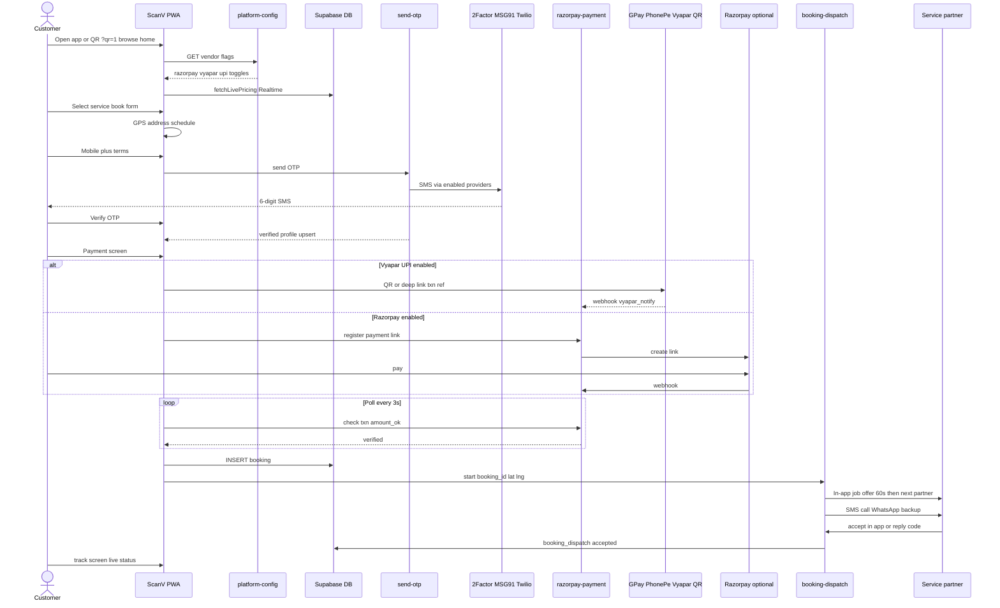
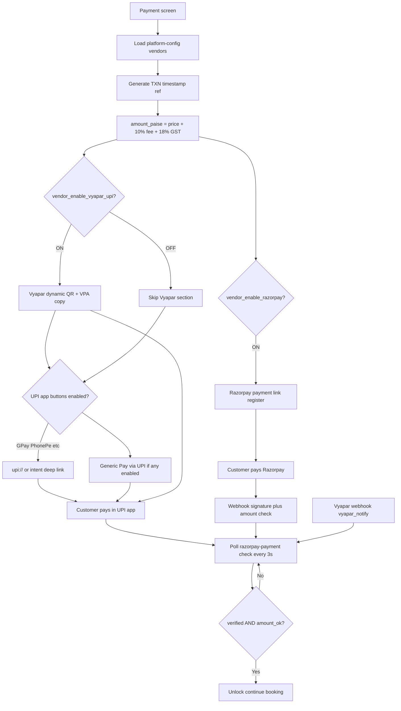
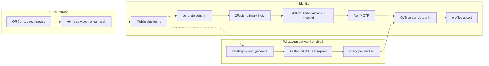
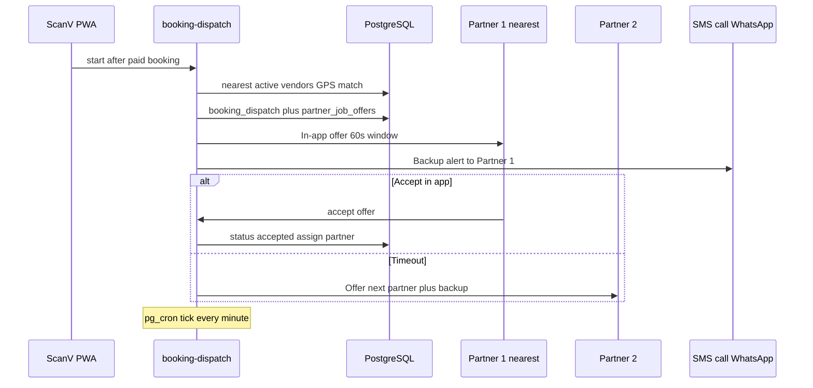
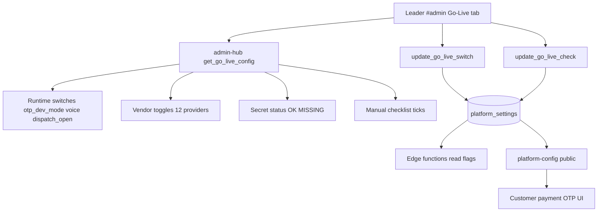
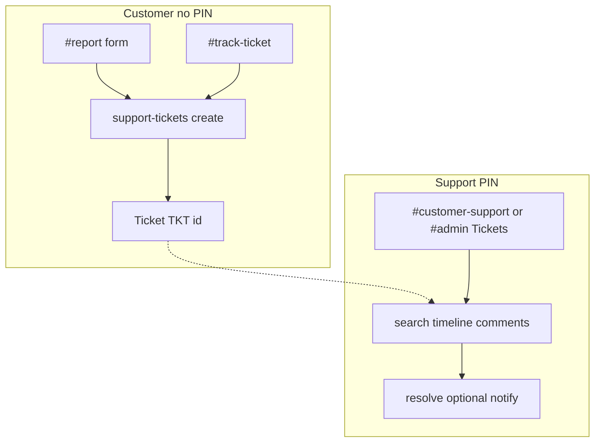
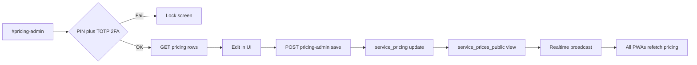

# ScanV — Application Data Flow

**Version:** v5.5.3 · **Updated:** 14 Aug 2026

> **Integration note:** Provider order and availability depend on Admin Go-Life vendor toggles and Supabase secrets. Diagrams show the current default path; alternate routes activate when primary providers are disabled or fail.

**View in browser:** [Data flow diagram](/docs/data-flow.html) · [Architecture](/docs/architecture.html)

---

## 1. Customer Booking Flow (End-to-End)

---

## 2. Payment Flow (Vyapar UPI + UPI Apps + Razorpay Backup)

**Security:** Client never sets `paymentVerified` without server `check`. Underpaid amounts rejected `amount_ok false`.

---

## 3. OTP & Identity Flow

**Delivery reporting:** 2Factor callback to `otp-delivery-report` when `OTP_REPORT_SECRET` configured.

---

## 4. Partner Dispatch Flow

Mode set in Admin Vendors tab: `both` in_app external disabled.

---

## 5. Admin Go-Live & Vendor Config Flow

---

## 6. Support Ticket Flow

---

## 7. Pricing Admin Flow

---

## 8. Data Flow Summary

| Flow | Entry | Storage | Exit |
|------|-------|---------|------|
| Browse | PWA home QR | `service_prices_public` | Service selection |
| Vendor flags | App boot | `platform_settings` via `platform-config` | UI show hide providers |
| Register | OTP verify | `profiles` GoTrue | Logged-in state |
| Pay | Payment screen | `payment_intents` | Booking unlock |
| Book | Confirm | `bookings` `service_requests` | Dispatch trigger |
| Dispatch | Edge fn | `booking_dispatch` `partner_job_offers` | Partner assigned |
| Track | `#track` | bookings dispatch join | Customer UI |
| Support | `#report` | `support_tickets` | Resolution |
| Admin | `#admin` | all tables service role | KPIs go-live |
| OTP report | `#otp-delivery-report` | `otp_delivery_reports` | Delivery status |

---

## 9. Related Docs

- [ARCHITECTURE.md](./ARCHITECTURE.md) — system and deployment diagrams  
- [ScanV-App-Flowcharts.md](./ScanV-App-Flowcharts.md) — app states and roles  
- [ALL-APIS-AND-WEBHOOKS.md](./ALL-APIS-AND-WEBHOOKS.md) — webhook URLs  
