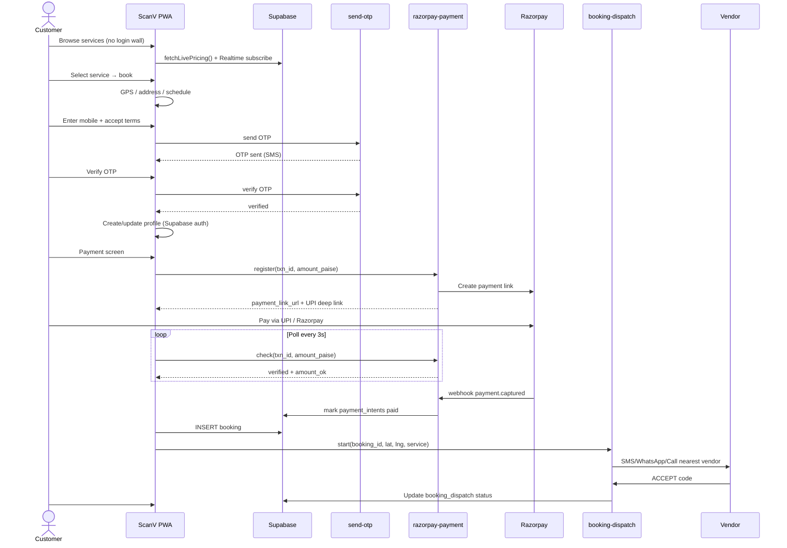
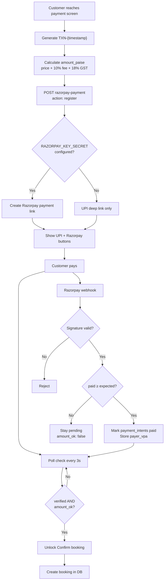
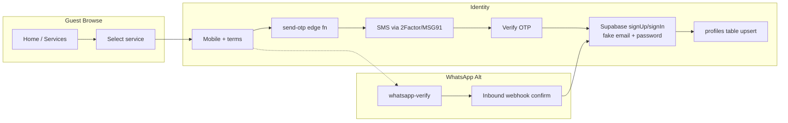
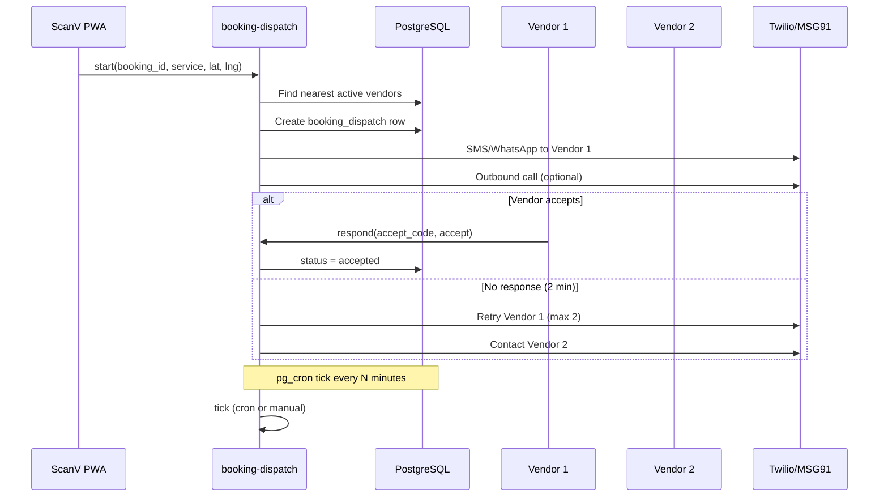
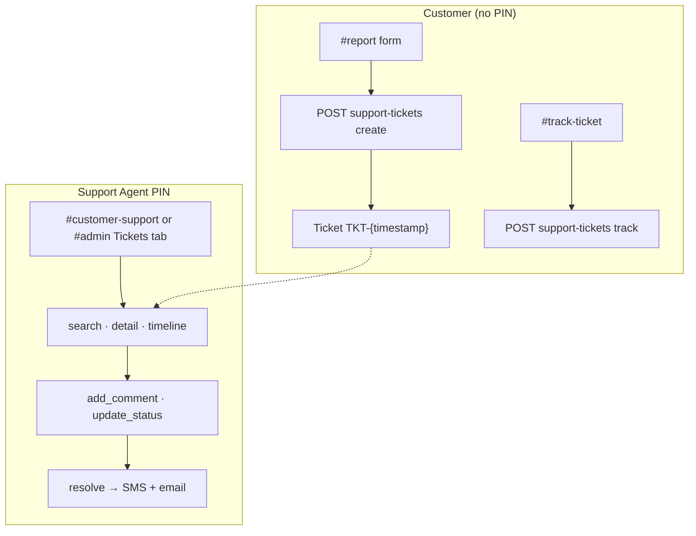
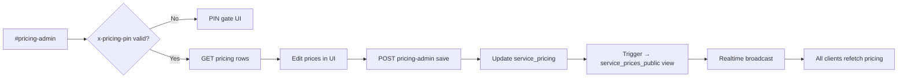
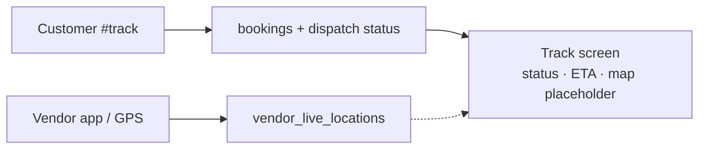

# ScanV — Application Data Flow

**Updated:** 12 Aug 2026

---

## 1. Customer Booking Flow (End-to-End)

---

## 2. Payment Flow with Amount Validation

**Security rules:**
- Client never sets `paymentVerified` without server `check`
- Underpaid amounts rejected (`amount_ok: false`)
- Webhook requires HMAC signature when secret configured

---

## 3. OTP & Registration Flow

---

## 4. Vendor Dispatch Flow

---

## 5. Support Ticket Flow

---

## 6. Pricing Admin Flow

---

## 7. Live Tracking Flow

---

## 8. Data Flow Summary Table

| Flow | Entry | Storage | Exit |
|------|-------|---------|------|
| Browse | PWA home | `service_prices_public` (read) | Service selection |
| Register | OTP verify | `profiles`, GoTrue auth | Logged-in state |
| Pay | Payment screen | `payment_intents` | Booking unlock |
| Book | Confirm | `bookings`, `service_requests` | Dispatch trigger |
| Dispatch | Edge function | `booking_dispatch`, attempts | Vendor assignment |
| Track | `#track` | bookings + dispatch join | Customer UI |
| Support | `#report` | `support_tickets`, comments | Resolution notify |
| Admin | `#admin` | All tables via service role | Dashboard KPIs |
