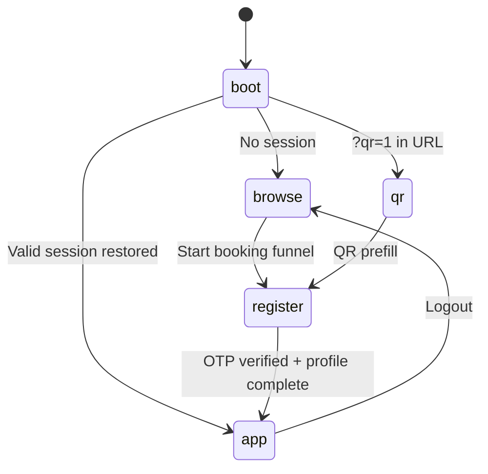

# ScanV — Application Logic Run-down

**Updated:** 14 Aug 2026 · **Version:** v5.5.3 · `src/App.js` (single-file React)

> **Diagrams:** [ARCHITECTURE.md](./ARCHITECTURE.md) · [APP-DATA-FLOW.md](./APP-DATA-FLOW.md) · Admin `#admin` → Architecture tab

---

## Root State Machine

**`App()` root states:** `boot` → `browse` | `qr` | `register` | `app`

**Routing priority (before main app):**
1. Legal pages (`/privacy`, `/terms`, `/refund`, `/payment`)
2. `#faq`, `#report`, `#track-ticket`
3. `#admin`, `#exec`, `#pricing-admin`, `#customer-support`, `#vendor-onboard`, `#vendor-admin`
4. Main app screens (home, services, bookings, profile, track, book flow)

---

## Configuration Block (Lines ~1–30)

| Constant | Purpose |
|----------|---------|
| `SB_URL` | Supabase project URL |
| `SB_KEY` | Publishable anon key |
| `APP_URL` | Production PWA URL |
| `ASSIST` | Support phone number |
| `UPI_VPA` | Merchant UPI ID for deep links |

---

## Design System

- **`C`** — Color tokens (Daylight Trust theme: `#f2efe8` bg, `#d63a56` accent)
- **`S`** — Style helpers (inputs, cards, buttons)
- **`APP_CSS`** — Injected global CSS + animations
- **Components:** `Btn`, `Field`, `Spin`, `Toast`, `StickyCta`, `Boundary`

---

## Service Catalog

### Categories (12 verticals)

| ID | Name | Services |
|----|------|----------|
| `legal` | Legal services | 8 services (consult, court, contracts, etc.) |
| `cloud` | Cloud & IT | Enterprise IaaS cards |
| `vip` | VIP concierge | Premium services |
| `health` | Health & wellness | Doctor home, lab, etc. |
| `property` | Property | Verification, loan assist |
| `household` | Household | Deep clean, home help (pink/green themes) |
| `delivery` | Delivery | Documents, parcels |
| `food` | Food & tiffin | Meal services |
| `two-wheeler` | 2-Wheeler | Wash, repair |
| `four-wheeler` | 4-Wheeler | Car care |

### Pricing Logic

- **`discPaise(mrp)`** — 25% discount calculation
- **`fetchLivePricing()`** — Loads overrides from `service_prices_public`
- **Realtime** — Subscribes to `service_prices_public` changes
- **Payment amount** — `price + 10% platform fee + 18% GST`

---

## Payment Module

### `usePaymentFlow` hook

1. Generate `TXN-{timestamp}` on mount
2. Call `razorpay-payment` register with exact `amount_paise`
3. Show UPI deep link + Razorpay payment link button
4. Poll `check` every 3 seconds after payment initiated
5. Unlock continue only when `verified && amount_ok`

### `RazorpayPayButton` / `PaymentSection`

- UPI via `upi://pay?pa=…&am=…&tn=TXN-…`
- Razorpay via dynamic payment link (server-created)
- WhatsApp Pay UPI ID blocked with message to use Razorpay

---

## OTP & Auth Module

### Server-side OTP (`invokeSendOtp`)

- Calls `send-otp` edge function (no client API keys)
- Supports SMS and WhatsApp verification paths
- **`OtpSentFooter`** — resend / change number UI

### Profile Auth Pattern

- Mobile verified → Supabase auth with `fakeEmail` + `fakePass` pattern
- Profile stored in `profiles` table
- Session restore: GoTrue session OR `localStorage scanv_uid`

### Silent Analytics (Boot)

- `visitor_sessions` insert (IP, device, canvas FP, battery)
- Background GPS → `silentGeo` state for prefill

---

## Booking Funnel (`BrowseFlow`)

**Steps for guest users:**

1. **Services** — Browse catalog, search, category filters
2. **Service detail** — Features, pricing, book CTA
3. **Verify** — Mobile OTP (SMS or WhatsApp)
4. **Payment** — UPI/Razorpay with amount validation
5. **Schedule** — Date, time, address, GPS
6. **Confirm** — Create booking + trigger dispatch

**Logged-in shortcut:** Skip OTP if `mobile_verified` profile exists.

### Booking Creation

- INSERT into `bookings` + `service_requests`
- INSERT `notifications` for user
- Invoke `booking-dispatch` start action
- Redirect to track screen

---

## Main App Screens (`state === 'app'`)

| Screen | Component | Purpose |
|--------|-----------|---------|
| `home` | Home dashboard | Quick actions, promos |
| `services` | Service grid | Category browse |
| `bookings` | Booking list | History + status |
| `crm` | CRM view | Service-specific tracking |
| `profile` | User profile | Edit details, logout |
| `track` | LiveTrackScreen | `#track?id=BK-…` |
| `book` | In-app booking | Logged-in book flow |

### Bottom Nav Tabs

Home · Services · Bookings · Profile (with notification badge)

---

## Admin Modules

### `#pricing-admin` — `PricingAdminPage`

- PIN gate → `x-pricing-pin` header
- Fetch/save via `pricing-admin` edge function
- Edits `service_pricing` → public view updates via Realtime

### `#admin` — `AdminControlCenter`

- Unified hub with tabs: Overview, Pricing, Support, Tickets, Agents, Vendors, Bookings, Settings
- Uses `admin-hub` edge function
- Agent CRUD on `support_agents` table

### `#exec` — `ExecDashboardPage`

- Executive KPIs: revenue, bookings, charts
- Requires owner PIN (`ADMIN_HUB_PIN` or `SUPPORT_ADMIN_PIN`)
- Actions: `exec_stats`, `exec_charts`

### `#customer-support` — `CustomerSupportPage`

- Read-only customer search (agent PIN)
- Admin PIN gets update capabilities
- Uses `customer-support` edge function

### `#vendor-onboard` — `VendorOnboardPage`

- Partner self-registration form
- OTP verify, PAN/eKYC via Digio
- Creates `vendor_partners` row (pending activation)

### `#vendor-admin` — `VendorAdminPage`

- List/activate/offboard partners
- PIN: `VENDOR_ADMIN_PIN`

---

## Support Ticket Module

### `#faq` — `FaqPage`

- Static FAQ accordion
- Links to `#report` and `#track-ticket`

### `#report` — `ReportPage`

- Public complaint form
- Creates ticket via `support-tickets` create action

### `#track-ticket` — `TrackTicketPage`

- Public status lookup (ticket # + mobile)
- No agent timeline exposed

### Admin Ticket Desk (in `#admin`)

- Full ticket queue, assignment, internal comments, resolve with SMS/email

---

## Tracking Module (`LiveTrackScreen`)

- Reads booking ID from hash `?id=` or sessionStorage
- Shows dispatch status, vendor info, ETA jokes/quips
- Links back to bookings list

---

## Legal Pages (`LegalPage`)

Path-based routes: `privacy`, `terms`, `refund`, `payment`

- Static content blocks per page
- Footer cross-links
- DCore · ScanV branding

---

## Edge Functions Reference

| Function | Triggered By | Key Actions |
|----------|--------------|-------------|
| `send-otp` | Registration, login, booking OTP | send, verify |
| `whatsapp-verify` | WhatsApp OTP path | send, webhook inbound |
| `razorpay-payment` | Payment screen | register, check, webhook |
| `pricing-admin` | Pricing admin UI | GET rows, POST save |
| `admin-hub` | Admin/exec dashboards | stats, agents, bookings, exec_charts |
| `customer-support` | Support desk | search, update (admin) |
| `support-tickets` | Report/track/admin | create, track, resolve |
| `vendor-onboard` | Vendor pages | register, verify, activate |
| `booking-dispatch` | Post-booking | start, tick, respond, webhooks |

---

## Database Tables

| Table | Written By | Purpose |
|-------|------------|---------|
| `profiles` | Client (RLS) | User identity |
| `bookings` | Client | Service bookings |
| `service_requests` | Client | Request details |
| `notifications` | Client | In-app alerts |
| `visitor_sessions` | Client (boot) | Analytics |
| `user_locations` | Client (GPS consent) | Location log |
| `payment_intents` | Edge (razorpay-payment) | Payment state |
| `service_pricing` | Edge (pricing-admin) | Admin price overrides |
| `service_prices_public` | DB view/trigger | Public pricing |
| `vendor_partners` | Edge (vendor-onboard) | Partner registry |
| `vendor_partner_services` | Edge | Partner service mapping |
| `vendor_otp` | Edge (send-otp) | OTP hashes |
| `booking_dispatch` | Edge (dispatch) | Dispatch state machine |
| `booking_dispatch_attempts` | Edge | Contact attempt log |
| `vendor_live_locations` | Edge/partner | Live GPS |
| `support_agents` | Edge (admin-hub) | Agent registry |
| `support_tickets` | Edge (support-tickets) | Ticket records |
| `support_ticket_comments` | Edge | Ticket timeline |
| `wa_verifications` | Edge (whatsapp-verify) | WA OTP state |

---

## Hash Route Reference

| Hash | Component | Auth |
|------|-----------|------|
| `#admin`, `#admin-hub` | AdminControlCenter | Admin PIN |
| `#exec`, `#exec-dashboard` | ExecDashboardPage | Owner PIN |
| `#pricing-admin` | PricingAdminPage | Pricing PIN |
| `#customer-support` | CustomerSupportPage | Agent/admin PIN |
| `#vendor-onboard` | VendorOnboardPage | Public |
| `#vendor-admin` | VendorAdminPage | Vendor admin PIN |
| `#track?id=…` | LiveTrackScreen | Public |
| `#faq` | FaqPage | Public |
| `#report` | ReportPage | Public |
| `#track-ticket` | TrackTicketPage | Public |

## Path Route Reference

| Path | Component |
|------|-----------|
| `/privacy` | LegalPage |
| `/terms` | LegalPage |
| `/refund` | LegalPage |
| `/payment` | LegalPage |

---

## Key Helper Functions

| Function | Purpose |
|----------|---------|
| `sb()` | Lazy Supabase client singleton |
| `reverseGeo(lat, lng)` | OSM Nominatim → address |
| `lookupPinByPlaceName(name)` | India Post PIN API |
| `detectDevice()` | UA parsing for analytics |
| `getIP()` | ipapi.co IP lookup |
| `discPaise(mrp)` | 25% discount |
| `fetchLivePricing()` | Load + cache public prices |
| `adminHubFetch(action, payload, pin)` | Admin API wrapper |
| `customerSupportFetch(...)` | Support API wrapper |
| `supportTicketsFetch(...)` | Tickets API wrapper |
| `vendorOnboardFetch(...)` | Vendor API wrapper |
| `pricingAdminFetch/Save(...)` | Pricing API wrapper |

---

*ScanV v5.5.2 · Single-file architecture · React 18 · Supabase backend*
