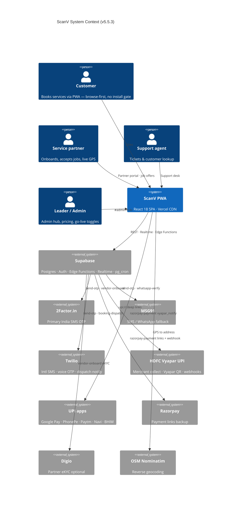
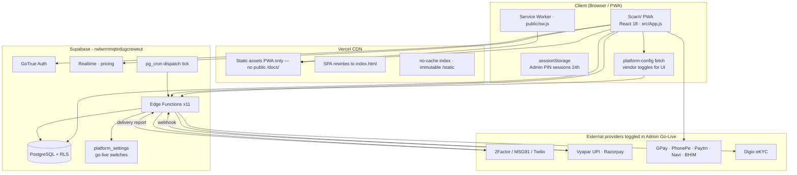
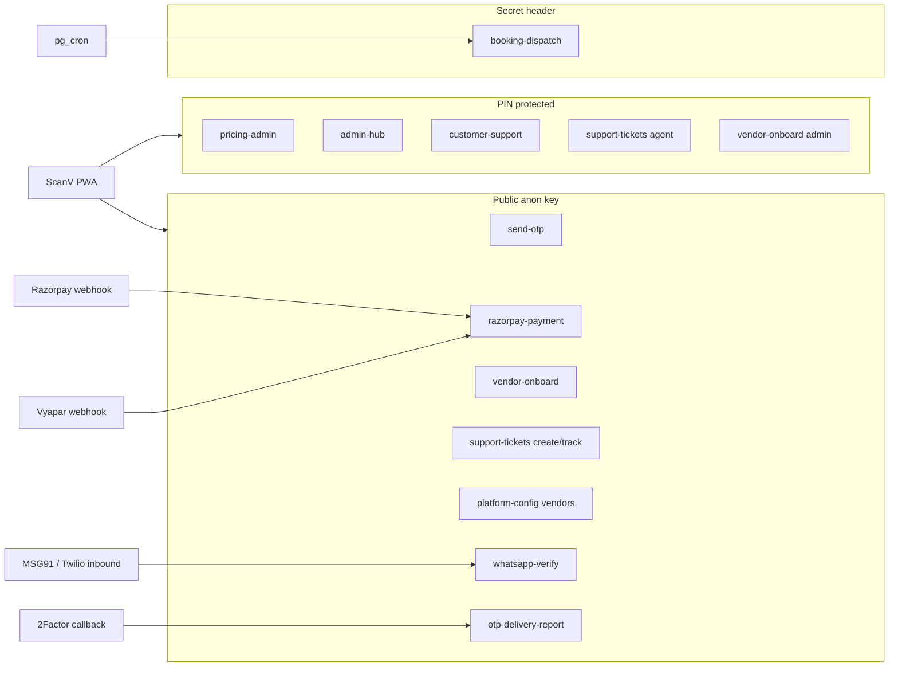
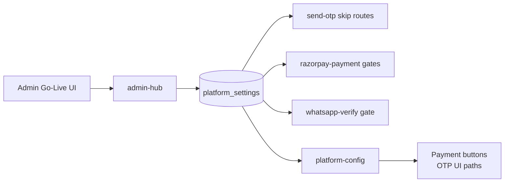
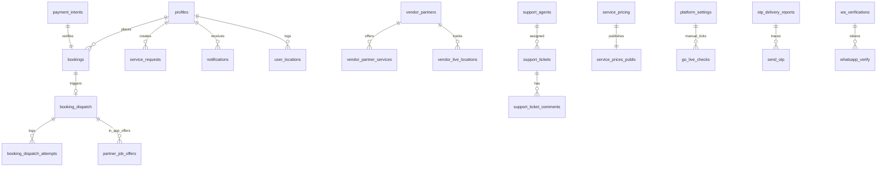
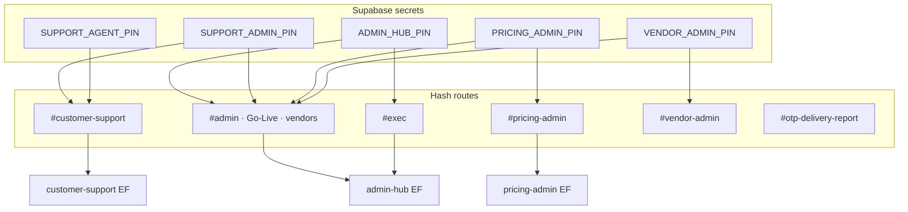
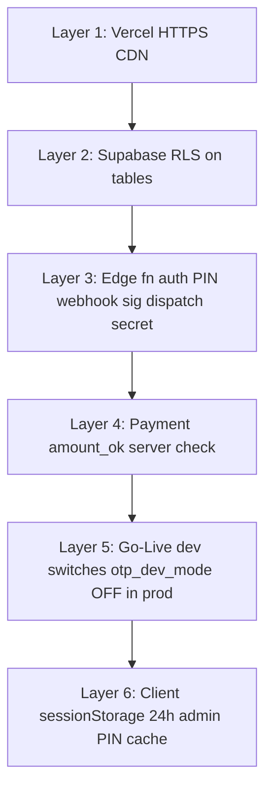

# ScanV — System Architecture

**Version:** v5.5.3 · **Updated:** 14 Aug 2026 · DCore  
**Production:** [https://scanv-tau.vercel.app](https://scanv-tau.vercel.app)

> **Integration note:** External service providers are pluggable via Admin Go-Live toggles. Diagrams may change as integrations are added.

> **Access:** Admin hub only — `#admin` → **Architecture** tab. Not published on the public website.

---

## 1. System Context

---

## 2. Deployment Architecture

| Environment | URL |
|-------------|-----|
| Production PWA | https://scanv-tau.vercel.app |
| QR landing | https://scanv-tau.vercel.app/?qr=1 |
| Printable QR | https://scanv-tau.vercel.app/scanv-qr.png |
| Architecture diagrams | Admin only → `#admin` → Architecture tab |

---

## 3. Edge Functions Map

---

## 4. Vendor & Provider Toggle Layer

Admin **Go-Live** stores flags in `platform_settings`. Edge functions and `platform-config` read them at runtime.

| Toggle key | Provider | Effect when OFF |
|------------|----------|-----------------|
| `vendor_enable_2factor` | 2Factor.in | Skip 2Factor OTP route |
| `vendor_enable_msg91` | MSG91 | Skip MSG91 SMS/WA |
| `vendor_enable_twilio` | Twilio | Skip Twilio SMS/voice |
| `vendor_enable_whatsapp` | WhatsApp verify | Block WA verification |
| `vendor_enable_razorpay` | Razorpay | Hide Razorpay; no links |
| `vendor_enable_vyapar_upi` | Vyapar QR | Hide Vyapar QR section |
| `vendor_enable_upi_*` | GPay, PhonePe, … | Hide matching UPI button |

---

## 5. Database Schema (Core)

---

## 6. Admin & Support Access Model

---

## 7. Security Layers

---

## 8. Technology Stack

| Layer | Technology |
|-------|------------|
| Frontend | React 18 · single-file `src/App.js` |
| Hosting | Vercel · scanv-tau.vercel.app |
| Backend | Supabase Edge Functions Deno x11 |
| Database | PostgreSQL Supabase Mumbai |
| Auth | GoTrue mobile OTP synthetic email |
| Payments primary | HDFC Vyapar UPI · UPI deep links GPay PhonePe Paytm Navi BHIM |
| Payments backup | Razorpay payment links |
| SMS OTP primary | 2Factor.in |
| SMS OTP fallback | MSG91 Twilio voice optional |
| WhatsApp | whatsapp-verify outbound plus reply |
| Partner dispatch | In-app sequential offers plus SMS call WhatsApp backup |
| Realtime | Supabase Realtime pricing |
| Cron | pg_cron booking-dispatch tick |

---

## 9. Related Documentation

| Document | Purpose |
|----------|---------|
| [APP-DATA-FLOW.md](./APP-DATA-FLOW.md) | Sequence and flow diagrams |
| [ScanV-App-Flowcharts.md](./ScanV-App-Flowcharts.md) | User journeys and roles |
| [ALL-APIS-AND-WEBHOOKS.md](./ALL-APIS-AND-WEBHOOKS.md) | Endpoint inventory |
| [GO-LIVE-CHECKLIST.md](./GO-LIVE-CHECKLIST.md) | Production readiness |
| [BACKUP-AND-SCALE.md](./BACKUP-AND-SCALE.md) | Backup DR and load |
| [ADMIN-HUB.md](./ADMIN-HUB.md) | Admin hub tabs |

*Diagrams reflect ScanV v5.5.3. Update when adding service-provider integrations.*
