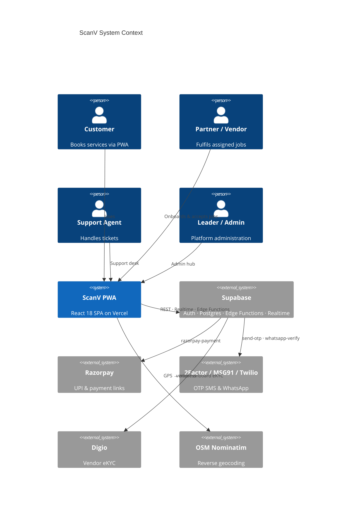
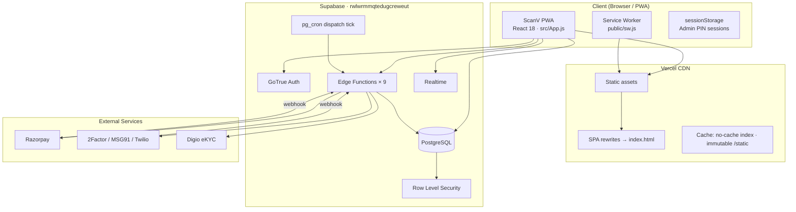
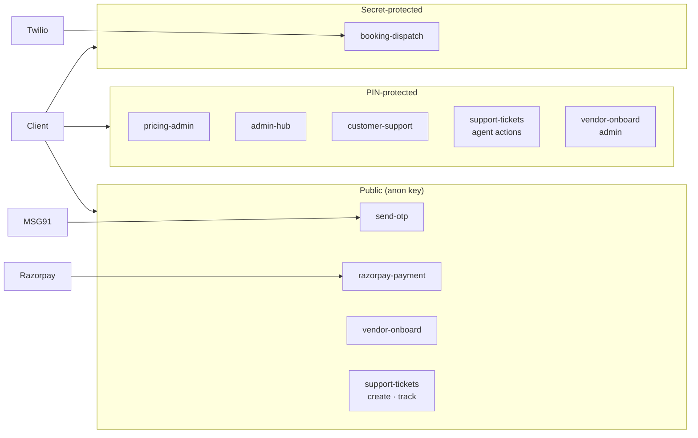
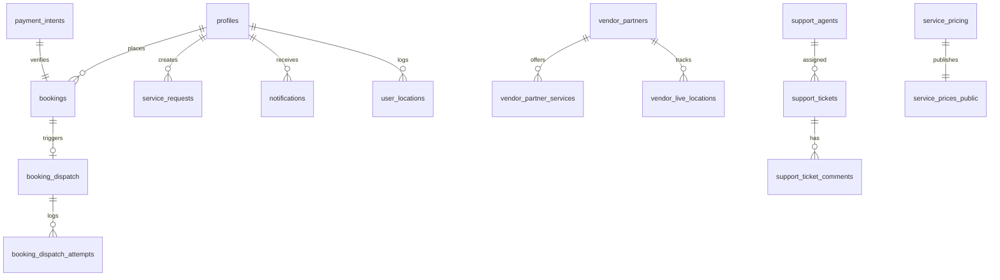
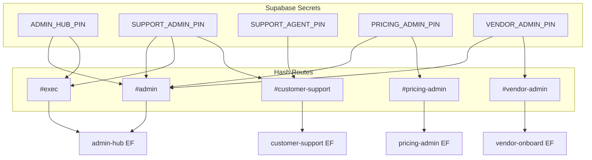
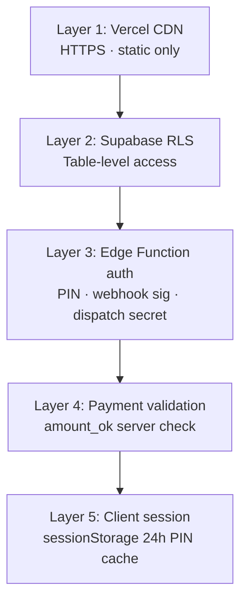

# ScanV — System Architecture

**Updated:** 12 Aug 2026 · DCORE Global Corporation

---

## 1. System Context

---

## 2. Deployment Architecture

---

## 3. Edge Functions Map

---

## 4. Database Schema (Core)

---

## 5. Admin & Support Access Model

| PIN | Hub | Exec | Pricing | Support Admin | Support Agent | Vendor |
|-----|-----|------|---------|---------------|---------------|--------|
| ADMIN_HUB_PIN | ✓ | ✓ | — | — | — | — |
| SUPPORT_ADMIN_PIN | ✓ | ✓ | — | ✓ | — | — |
| PRICING_ADMIN_PIN | ✓ | — | ✓ | — | — | — |
| VENDOR_ADMIN_PIN | ✓ | — | — | — | — | ✓ |
| SUPPORT_AGENT_PIN | — | — | — | — | ✓ | — |

---

## 6. Security Layers

---

## 7. Technology Stack

| Layer | Technology |
|-------|------------|
| Frontend | React 18, single-file App.js (~7K lines) |
| Hosting | Vercel (scanv-tau.vercel.app) |
| Backend | Supabase Edge Functions (Deno) |
| Database | PostgreSQL (Supabase) |
| Auth | Supabase GoTrue (mobile OTP → fake email auth) |
| Payments | Razorpay payment links + UPI |
| SMS/WhatsApp | 2Factor, MSG91, Twilio |
| Realtime | Supabase Realtime (pricing updates) |

---

## 8. Migration Inventory

15 SQL migrations in `supabase/migrations/` (Aug 2026 batch):

| Migration | Purpose |
|-----------|---------|
| `20260811000000` | WhatsApp verifications |
| `20260811000001` | WA outbound |
| `20260811000002` | Payment intents |
| `20260811000003` | Service pricing + RLS |
| `20260812000004` | Sub-services pricing |
| `20260812000005` | Fill grid pricing |
| `20260812000006` | Vendors & dispatch + RLS |
| `20260812000007` | Live tracking & vehicle pricing |
| `20260812000008` | Dispatch cron |
| `20260812000009` | Vendor live locations RLS |
| `20260812000010` | Pricing realtime vehicle cards |
| `20260812000011` | Customer support roles |
| `20260812000012` | Support tickets |
| `20260812000013` | Ticket comment internal flag |
| `20260812000014` | Payer VPA |
