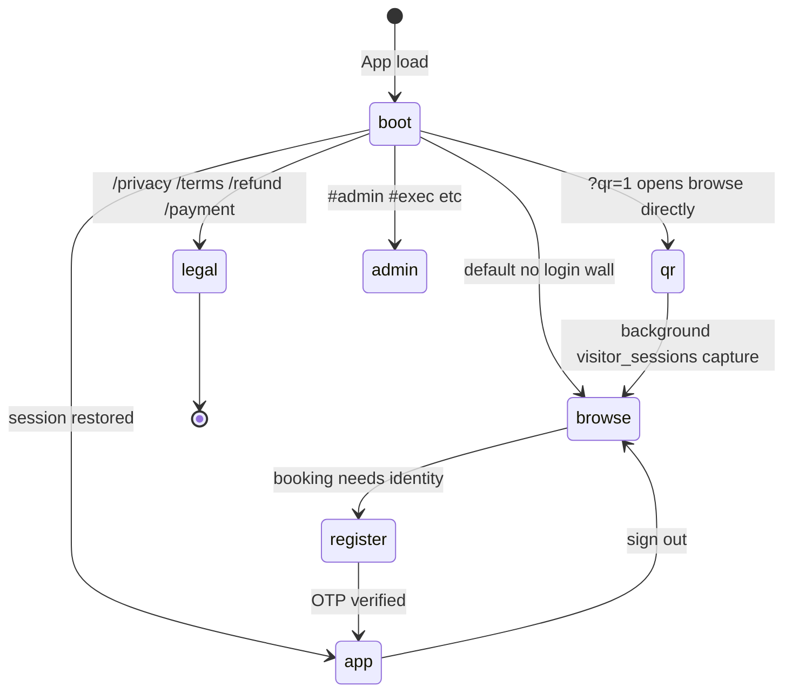
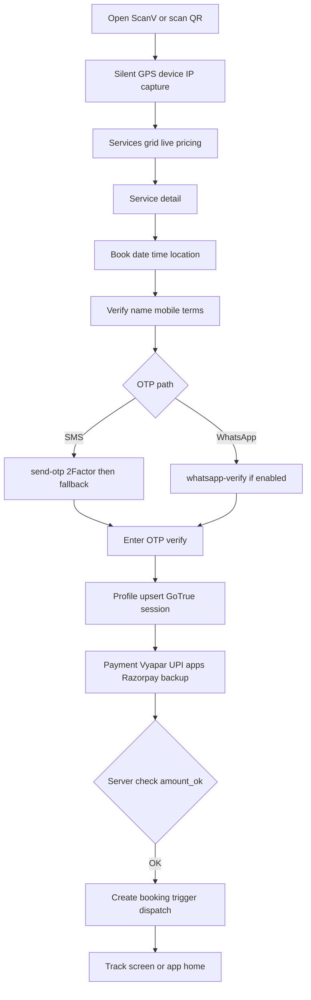
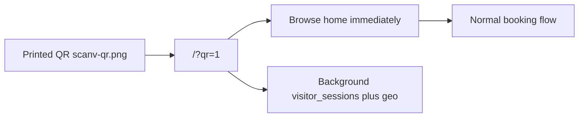
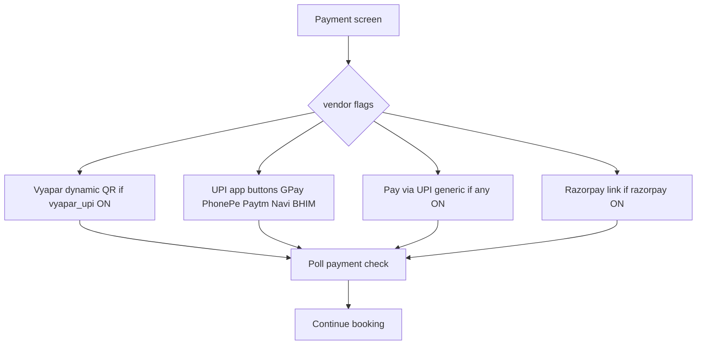

# ScanV — Application Flow Charts

**Version:** v5.5.3 · **Updated:** 14 Aug 2026 · DCore  
**Live:** [https://scanv-tau.vercel.app](https://scanv-tau.vercel.app)

> Canonical data-flow sequences: [APP-DATA-FLOW.md](./APP-DATA-FLOW.md) · System context: [ARCHITECTURE.md](./ARCHITECTURE.md)  
> **Browser view:** Admin hub → **Architecture** tab (PIN required)

Provider integrations may change — see Admin → Go-Live vendor toggles.

---

## 1. High-Level App States



---

## 2. Browse-First Booking (Guest → Customer)



---

## 3. QR Entry (v5.5.3)



No “Add to Home Screen” gate — browser-first.

---

## 4. Payment Method Selection (Customer UI)

Controlled by `platform-config` vendor flags from Admin Go-Live.



---

## 5. Logged-In Navigation

```mermaid
flowchart TB
    subgraph BottomNav["Bottom nav"]
        H[Home]
        S[Services]
        B[Bookings]
        C[CRM partner admin only]
        P[Profile]
    end
    H --> Recent activity
    S --> Search book
    B --> History track
    C --> Partner CRM
    P --> Account legal sign out
```

---

## 6. Roles

| Role | Sign-up | Book & pay | CRM | Admin routes |
|------|---------|------------|-----|--------------|
| Customer | During first booking | ✓ | — | — |
| Service partner | `#vendor-onboard` | Assigned jobs | ✓ | `#vendor-admin` PIN |
| Support agent | Admin-created | — | Desk | `#customer-support` |
| Leader | Admin account | — | ✓ | `#admin` `#exec` `#pricing-admin` |

---

## 7. Service Categories (12 verticals)

`legal` · `cloud` · `vip` · `health` · `property` · `household` · `delivery` · `food` · `two-wheeler` · `four-wheeler` · plus sub-services from `service_pricing`.

Cash-on-service categories flagged in catalog (`household`, `delivery`, `food`, etc.).

---

## 8. Legal Routes

| Route | Page |
|-------|------|
| `/privacy` | Privacy Policy DPDP Act 2023 |
| `/terms` | Terms & Conditions |
| `/refund` | Refund Policy |
| `/payment` | Payment Policy |

---

*Updated for ScanV v5.5.3 · See [APP-DATA-FLOW.md](./APP-DATA-FLOW.md) for webhook and dispatch sequences.*
