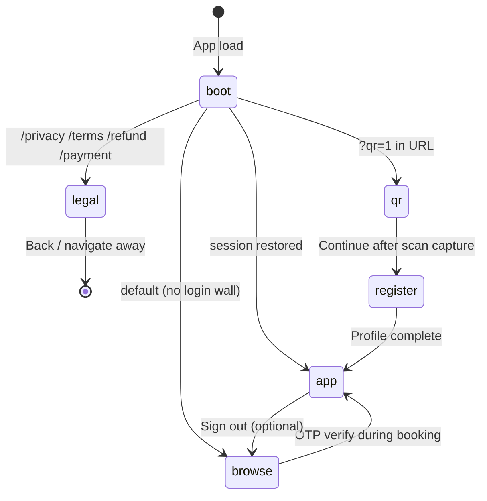
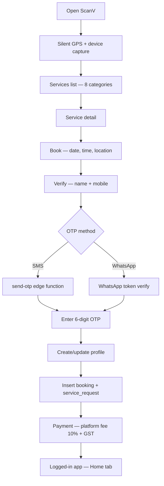
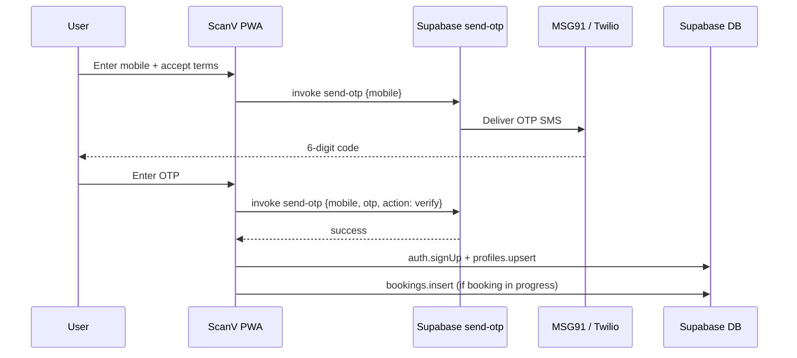
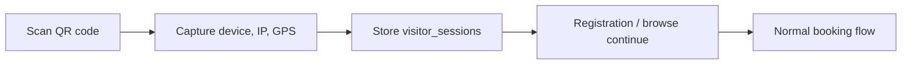
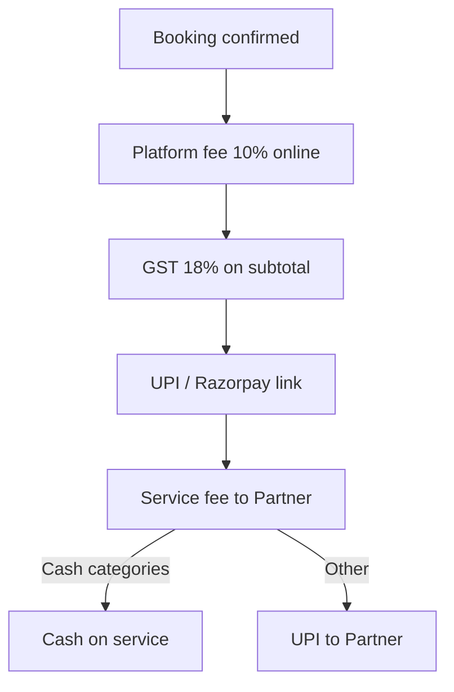

# ScanV v5.4 — Application Flow Charts

**DCORE Global Corporation · PCMC, Pune**  
Stack: React PWA · Supabase · Vercel · Razorpay/UPI  
Live: https://scanv-tau.vercel.app

---

## 1. High-Level App States



---

## 2. Browse-First Booking Flow (Guest → Customer)

No registration wall. Users browse services first; identity is collected at checkout.



---

## 3. OTP Verification Flow



---

## 4. QR Scan Entry Flow

Triggered by `?qr=1` or printed QR linking to scanv-tau.vercel.app/?qr=1



**Leader (admin)** can generate printable QR from Home → ScanV QR Code.

---

## 5. Logged-In App Navigation

```mermaid
flowchart TB
    subgraph Bottom Nav
        H[Home]
        S[Services]
        B[Bookings]
        C[CRM — partner/admin only]
        P[Profile]
    end

    H --> Recent bookings + service grid
    S --> Search + detail + book
    B --> Booking history + status
    C --> CRM dashboard
    P --> Account, legal links, sign out
```

---

## 6. Role-Based Access

```mermaid
flowchart TD
    subgraph Roles
        CU[Customer]
        CA[Candidate]
        PA[Partner]
        LE[Leader / admin]
    end

    CU --> Browse & book
    CU --> Own bookings
    CA --> Badge display only
    PA --> CRM + assigned jobs
    LE --> CRM + QR + platform stats
```

| Role | Sign-up | Bottom nav | CRM | QR generator |
|------|---------|------------|-----|--------------|
| Customer | During first booking | Home, Services, Bookings, Profile | — | — |
| Candidate | Not implemented | Same as customer | — | — |
| Partner | Admin-assigned | + CRM tab | ✓ | — |
| Leader | Admin account | + CRM tab | ✓ | ✓ |

---

## 7. Payment Flow



**Pricing:** Default ₹500 service (50000 paise) unless overridden per service.

---

## 8. Legal & Compliance Pages

| Route | Page |
|-------|------|
| `/privacy` | Privacy Policy — DPDP Act 2023 |
| `/terms` | Terms & Conditions |
| `/refund` | Refund Policy |
| `/payment` | Payment Policy |

Footer links on browse screen and profile. Served by `LegalPage` component with early route detection.

---

## 9. Service Categories

| ID | Category | Cash on service |
|----|----------|-----------------|
| legal | Legal services | No |
| cloud | Cloud training | No |
| vip | VIP appointments | No |
| health | Health care | No |
| property | Property & rentals | No |
| household | Household services | Yes |
| delivery | Deliveries | Yes |
| food | Food | Yes |

---

## 10. Data Captured (Silent + Explicit)

**Silent on load:** IP, device type, OS, browser, timezone, language, battery, canvas fingerprint, GPS (if permitted)

**Explicit at booking:** Name, mobile (OTP), address, village, city, pincode, booking notes

**Stored in:** `visitor_sessions`, `profiles`, `bookings`, `service_requests`, `notifications`

---

*Updated: 11 August 2026 · ScanV v5.4*
