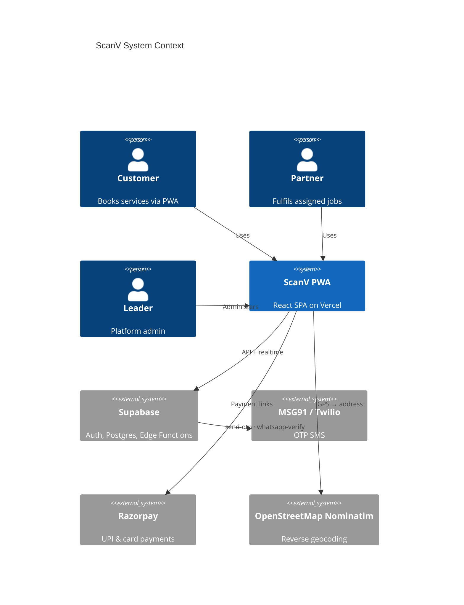
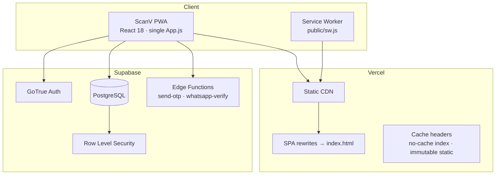
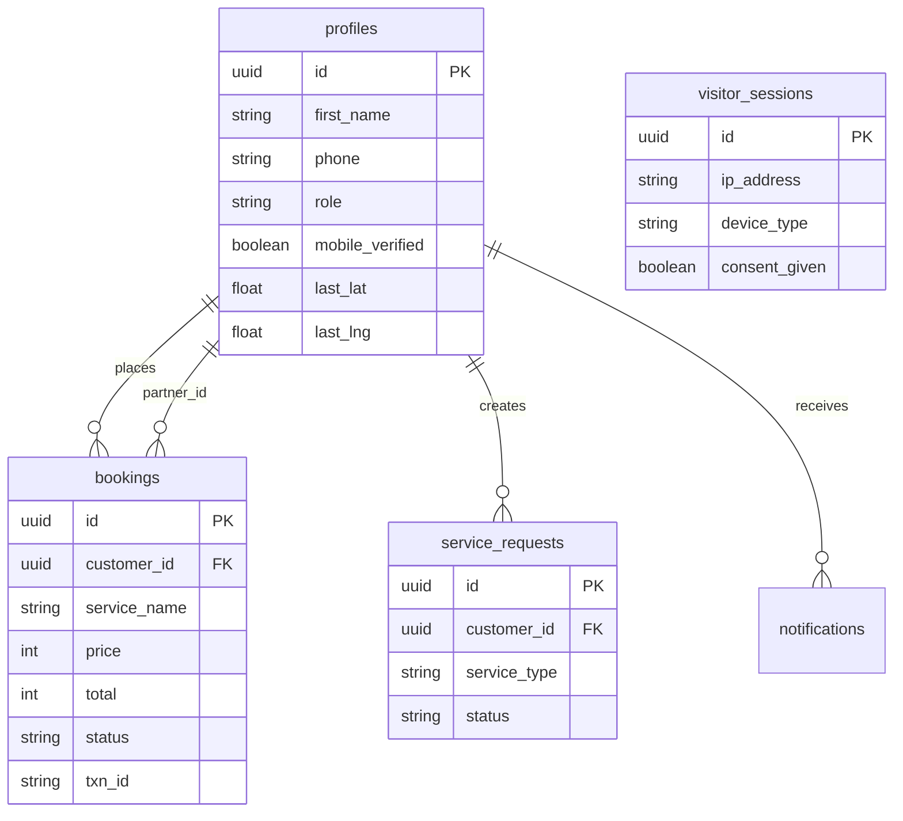
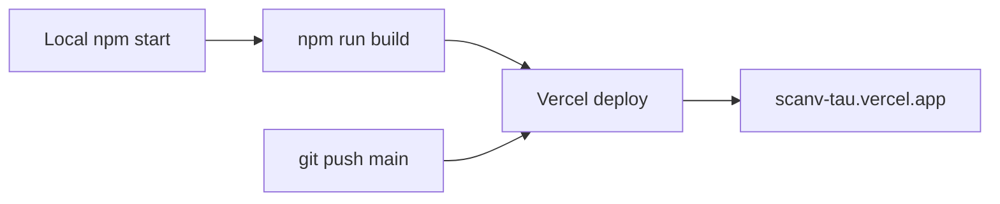

# ScanV v5.4 — System Architecture

**DCORE Global Corporation · PCMC, Pune**

---

## 1. System Context



---

## 2. Deployment Architecture



| Environment | URL | Notes |
|-------------|-----|-------|
| Production | https://scanv-tau.vercel.app | Primary ScanV deployment |
| Alternate | https://scanverse-tau.vercel.app | Same project alias |
| Wrong app | https://scanverse.vercel.app | Legacy QR scanner — not ScanV |

---

## 3. Application Structure

Single-file React architecture (`src/App.js` ~2,100 lines):

```
App.js
├── Config (Supabase URL, Razorpay, UPI)
├── Design tokens (C, S, APP_CSS)
├── Supabase client (sb())
├── Primitives (Btn, Field, Badge, Toast, Spin)
├── BrowseFlow (guest booking funnel)
├── QRLandingPage
├── Main screens (Home, Services, Bookings, CRM, Profile)
├── LegalPage (/privacy, /terms, /refund, /payment)
└── App() root — state machine + routing
```

**State machine keys:** `boot` → `browse` | `qr` | `register` | `app`

---

## 4. Database Schema (Core Tables)



---

## 5. Authentication Model

- **No password UX** — synthetic email `{mobile}@scanv.app` + generated password
- **OTP gate** — `mobile_verified` must be true before app access
- **Session restore** — Supabase session + `localStorage scanv_uid` fallback
- **Terms** — `localStorage scanv_terms_accepted` required before OTP send

### Mobile verification paths

| Path | Trigger | Flow |
|------|---------|------|
| **SMS OTP (primary)** | User chooses SMS or WA unavailable | `send-otp` → 6-digit code → verify |
| **WhatsApp (backup)** | User chooses WA or SMS fails | `whatsapp-verify` generate → **outbound WA to user** → user replies → poll `check` every 3s |

Server sends: `ScanV verification: Reply VERIFY {token} to confirm your booking.`  
Tokens stored in `wa_verifications` (30 min TTL). See `supabase/functions/whatsapp-verify/README.md`.

---

## 6. Edge Functions

### send-otp

```
POST /functions/v1/send-otp
Body: { mobile: "+91XXXXXXXXXX" }
     | { mobile, otp, action: "verify" }

Providers: MSG91 (primary, India) · Twilio (fallback)
```

### whatsapp-verify

```
POST /functions/v1/whatsapp-verify
Body: { action: "generate", mobile: "+91XXXXXXXXXX" }
     | { action: "check", token: "SCANV-XXXX" }
     | inbound webhook (MSG91/Twilio) or { action: "webhook", ... }

generate: creates token, sends outbound WhatsApp TO user mobile, returns { messageSent, provider }
check:    returns verified after inbound reply (strict) or honor delay (dev)
webhook:  parses MSG91/Twilio inbound payloads, marks token verified
```

---

## 7. Security & Compliance

| Area | Implementation |
|------|----------------|
| Data residency | AWS Mumbai (Supabase region) |
| Privacy law | DPDP Act 2023 — documented in LegalPage |
| Transport | TLS 1.3 |
| Payments | Razorpay PCI-DSS L1 — no card storage in app |
| PWA | manifest.json, service worker, installable |

**Known hardening items:** Move API keys to env-only; rotate any exposed tokens; enable RLS audit on all tables.

---

## 8. Build & Release Pipeline



`package.json` uses `REACT_APP_TS` cache-bust on build.  
`vercel.json` sets no-cache on `index.html`, immutable on `/static/*`.

---

## 9. Fixed Issues (v5.4.1)

| Issue | Fix |
|-------|-----|
| Legal pages blank | `APP_CSS` hoisted to module scope; legal route after hooks |
| Privacy on home | Strict pathname equality via `legalPathname()` |
| Unicode display | UTF-8 middle dot characters in source |

---

*Updated: 11 August 2026 · ScanV v5.4*
